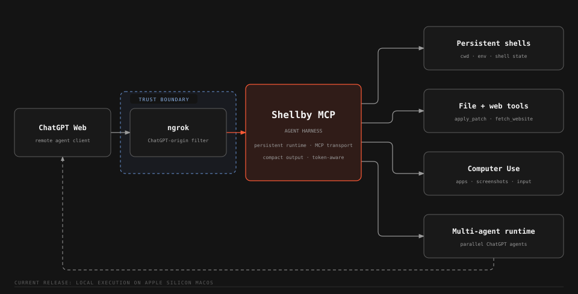

<h1 align="center">Shellby MCP</h1>

<p align="center">
  A local MCP server that gives ChatGPT Web persistent shells, direct file editing, Computer Use, browser-backed subagents, webpage tools, and reusable skills on macOS.
</p>

<p align="center">
  <a href="https://github.com/Serbyte-Development/shellby-mcp/actions/workflows/ci.yml"></a>
  <a href="LICENSE"></a>
  
</p>

<p align="center">
  <a href="#quick-start">Quick start</a> ·
  <a href="#operations">Operations</a> ·
  <a href="#security">Security</a> ·
  <a href="wiki/">Maintainer wiki</a>
</p>

> [!CAUTION]
> Shellby MCP runs with the full permissions of your local macOS user. An authorized ChatGPT caller can run commands, edit files, fetch webpages, and control supported applications.



## Capabilities

| Capability           | Description                                                                                  |
| -------------------- | -------------------------------------------------------------------------------------------- |
| Persistent shells    | Named login shells retain cwd, environment, processes, and command history across MCP calls. |
| Native `apply_patch` | Native ChatGPT `apply_patch` binary used to edit files independently of shell state.         |
| Computer Use         | Focused macOS observation and interaction backed by [Peekaboo](https://peekaboo.sh/).        |
| Browser subagents    | Detached ChatGPT Web conversations with follow-up context and concurrent result retrieval.   |
| Web and images       | Rendered webpage extraction, bounded document pagination, and native image transport.        |
| Dynamic skills       | Reusable workflows loaded from `<workspace>/skills/*/SKILL.md`.                              |

## Requirements

- macOS on Apple Silicon or Intel
- Node.js 22.13.0 or newer
- npm
- An [ngrok](https://ngrok.com/) account and CLI
- A ChatGPT Plus or Higher account with Developer Mode turned on

Google Chrome is optional and is used for browser-backed subagents. Computer Use is optional and uses the Peekaboo package installed with this repository.

## Quick start

### Install with your coding agent

[`skills/install-shellby-mcp/SKILL.md`](skills/install-shellby-mcp/SKILL.md)

### Manual install

> [!TIP]
> The manual install process should be ran from Terminal.app for the best macOS permission context.

1. Install ngrok, clone the repository, and install dependencies:

   ```bash
   brew install --cask ngrok
   git clone https://github.com/Serbyte-Development/shellby-mcp.git
   cd shellby-mcp
   npm ci
   ```

2. Authenticate ngrok:

   ```bash
   ngrok config add-authtoken <your-token>
   ```

   Get an authtoken from the [ngrok dashboard](https://dashboard.ngrok.com/get-started/your-authtoken) if needed.

3. Create the active Shellby config:

   ```bash
   npm run setup -- --config-only
   ```

   Review `.shellby/config.toml` and edit any values you want to customize. The generated file is complete and active; Shellby does not merge hidden defaults into it.

4. Run guided setup:

   ```bash
   npm run setup
   ```

   Setup checks the machine, prepares the workspace, and builds Shellby MCP. It also checks Computer Use and prepares the dedicated ChatGPT Chrome profile when those tool groups are enabled.

5. Run the first managed start from Terminal.app:

   ```bash
   npm start
   ```

   This creates or reuses the repository-local PM2 runtime, starts Shellby MCP and ngrok, launches the configured ChatGPT browser when agent tools are enabled, waits for local health, and prints the public `/mcp` URL. Starting from Terminal.app gives the managed process tree the intended macOS permission context for Computer Use.

6. In ChatGPT Developer Mode, create a custom MCP app with the printed `https://.../mcp` URL and select **No Auth**.

> [!IMPORTANT]
> The first trusted remote tool call binds the installation to that ChatGPT subject. Use `npm run auth:reset` only when you intend to clear that binding.

### Verify the installation

```bash
npm run status
curl -fsS http://127.0.0.1:3333/healthz
npm run print-url
```

The local MCP endpoint is `http://127.0.0.1:3333/mcp`.

## Optional capabilities

<details>
<summary><strong>Computer Use</strong></summary>

Shellby ships a package-local Peekaboo CLI build that matches its Computer Use adapter. Check or grant permissions with:

```bash
npm run setup:computer
```

Screen Recording enables observation. Accessibility and Event Synthesizing enable actions. Shellby always uses its bundled Peekaboo executable so the adapter and CLI stay on the tested version together.

See [Computer Use](wiki/pages/computer-use.md) for runtime details.

</details>

<details>
<summary><strong>Browser-backed ChatGPT subagents</strong></summary>

Run the dedicated browser setup when Chrome was unavailable during initial setup or when you want to configure it later:

```bash
npm run setup:chatgpt
```

This creates a dedicated Chrome profile under `~/.shellby/chatgpt-chrome` and attaches over CDP at `127.0.0.1:9222`. Sign into ChatGPT once in that profile. Future `npm start` runs launch it automatically while clone or subagent tools are enabled.

Conversation URL and turn count are persisted for reused `agent_id` values. Use `npm run reset-agents` to forget those local mappings.

See [Browser ChatGPT Subagents](wiki/pages/subagents/browser-chatgpt-subagents.md) for lifecycle details.

</details>

## Operations

| Command                | Purpose                                                                        |
| ---------------------- | ------------------------------------------------------------------------------ |
| `npm start`            | Build and start or reload Shellby MCP, ngrok, and enabled supporting services. |
| `npm run restart`      | Clear the current audit log, rebuild, and reload the managed runtime.          |
| `npm run status`       | Show PM2 process state.                                                        |
| `npm run logs`         | Follow PM2 logs.                                                               |
| `npm run print-url`    | Print the active public `/mcp` URL.                                            |
| `npm run stop`         | Stop the managed Shellby MCP and ngrok processes.                              |
| `npm run auth:reset`   | Clear the bound remote ChatGPT subject after confirmation.                     |
| `npm run reset-agents` | Forget persisted subagent conversation mappings.                               |

PM2 is installed as a repository dependency.

### Update an existing installation

```bash
git pull
npm ci
npm run setup -- --config-only
npm start
```

## Configuration

Shellby's public configuration is the gitignored `.shellby/config.toml`. `npm run setup` creates a complete active config for new installations and fills newly introduced fields on later setup runs while preserving existing user values. Every user-configurable Shellby value is read from this file.

The TOML surface currently owns the workspace, shell path, ChatGPT CDP/project routing, MCP tool-output format, and startup-static tool groups. The generated config enables every tool group and defaults tool output to `compact`. Setting a group to `false` removes those tools from `tools/list` after Shellby restarts and skips its supporting runtime service where one exists. `start_here` is always published. For example, this customization disables browser-backed agents and Computer Use:

```toml
workspace = "~/Desktop/agent-workspace"

[shell]
path = "/bin/zsh"

[chatgpt]
cdp_endpoint = "http://127.0.0.1:9222"
project_url = "https://chatgpt.com/"

[mcp]
tool_output = "compact"

[tools]
review = true
shell = true
apply_patch = true
clones = false
subagents = false
web = true
skills = true
image = true
computer = false
```

`mcp.tool_output` controls the representation used for ordinary tool results. `compact` is optimized for model context and omits public output schemas; `structured` preserves each tool's structured result and output schema for MCP clients that use them. Computer Use and `image_view` keep their native MCP content in either mode. Changing this setting requires a Shellby restart.

Shellby does not use a repository `.env` file. User-configurable Shellby settings come only from `.shellby/config.toml`; external tools use their normal machine-level configuration. In particular, ngrok is resolved from `PATH` and authentication is configured with `ngrok config add-authtoken`. Chrome is discovered in the normal macOS application locations, and Shellby uses its bundled Peekaboo build. Host, port, runtime limits, and other non-configurable settings remain code-owned in [`src/config.ts`](src/config.ts).

## Troubleshooting

<details>
<summary><strong>Setup or startup fails</strong></summary>

Run:

```bash
npm run preflight
npm run status
npm run logs
```

`preflight` checks the supported macOS/Node environment, local dependencies, ngrok installation, and ngrok authentication. If `/healthz` does not become available after startup, inspect PM2 status and logs first.

</details>

<details>
<summary><strong>Computer Use permissions are missing</strong></summary>

Run `npm run setup:computer` from Terminal.app and follow Peekaboo's permission guidance. Keep the managed Shellby process associated with the same intended Terminal permission context.

</details>

<details>
<summary><strong>The PM2 daemon needs to be recreated</strong></summary>

Check whether that PM2 daemon manages other applications before killing it. `./node_modules/.bin/pm2 kill` stops every application attached to the daemon. After recreating it, run `npm start` from Terminal.app.

</details>

More startup and recovery details are in [Configuration and Startup](wiki/pages/operations/configuration-and-startup.md).

## Security

- The checked-in ngrok traffic policy exposes the local MCP endpoint to ChatGPT.
- Direct localhost MCP access is unauthenticated. Do not expose the local endpoint through another untrusted proxy.
- Trusted remote tool calls are bound to the first ChatGPT subject stored in `~/.shellby/auth.json`.
- The dedicated authenticated Chrome profile is part of the trust boundary for browser subagents.
- `agent-commands.yaml` can contain sensitive tool inputs. It is gitignored and permission-restricted and should be treated as private.

See [SECURITY.md](SECURITY.md) for reporting and scope.

## Development

```bash
npm run dev
npm run lint
npm run typecheck
npm test
npm run build
```

Use `npm run inspect` for the MCP inspector and `npm run schemas` to print the published tool schemas. Authenticated browser tests are excluded from CI. See [Build and Test](wiki/pages/operations/build-and-test.md).

## Documentation

The [maintainer wiki](wiki/) contains implementation and operational details:

- [Project Overview](wiki/pages/project-overview.md)
- [Architecture Map](wiki/pages/architecture-map.md)
- [Configuration and Startup](wiki/pages/operations/configuration-and-startup.md)
- [Computer Use](wiki/pages/computer-use.md)
- [MCP Tool Surface](wiki/pages/mcp-tool-surface.md)
- [Build and Test](wiki/pages/operations/build-and-test.md)
- [Open Questions and Risks](wiki/pages/project/open-questions-and-risks.md)

## Contributing

Read [CONTRIBUTING.md](CONTRIBUTING.md) before opening a pull request. Run the development validation commands above for code changes.

## License

[MIT](LICENSE). The vendored `apply_patch` binary retains its upstream OpenAI Codex license and notices under [`vendor/apply-patch/`](vendor/apply-patch/).

Shellby MCP is created and maintained by [Serbyte Development](https://www.serbyte.net/).
