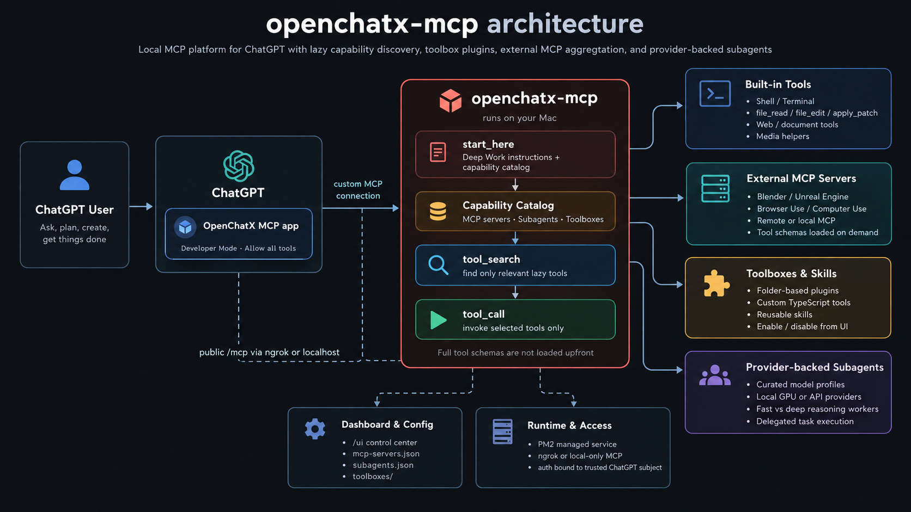
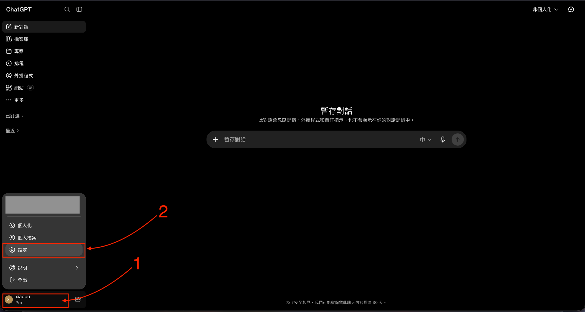
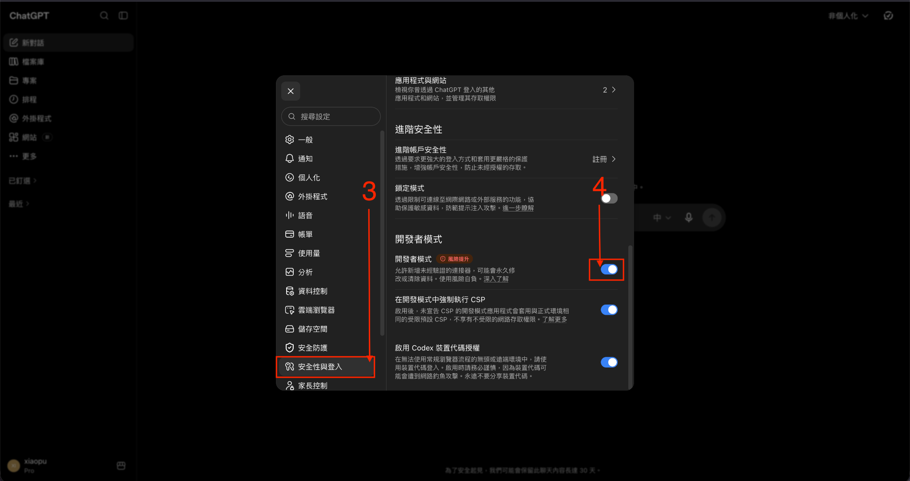
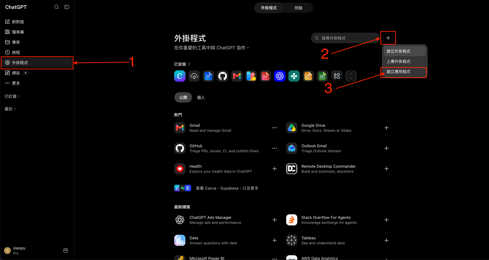
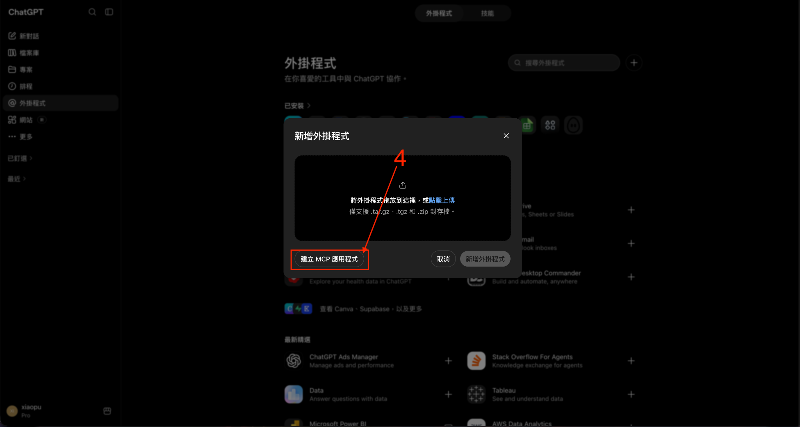
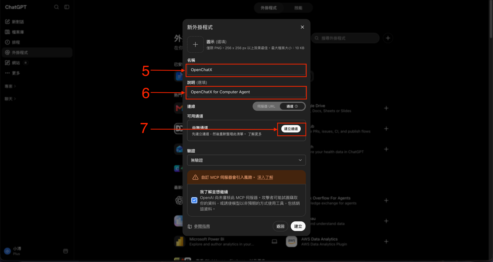
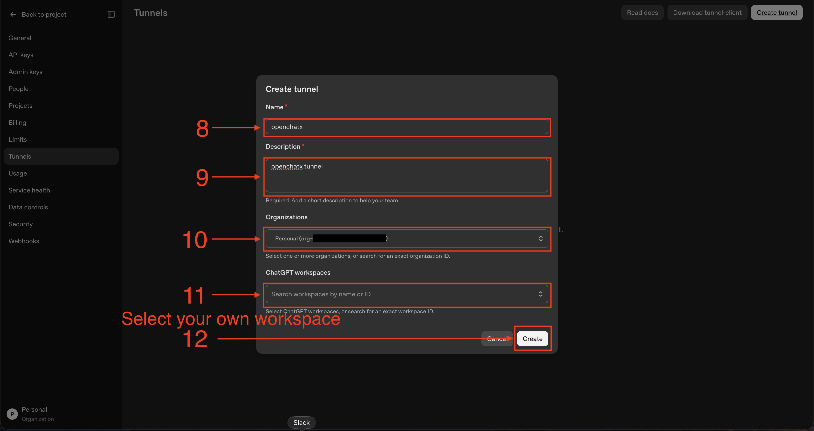
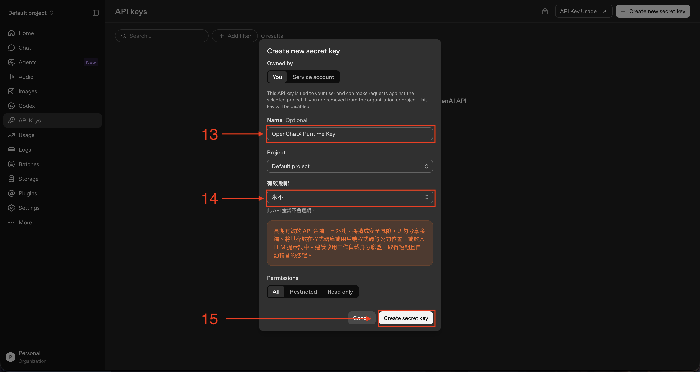
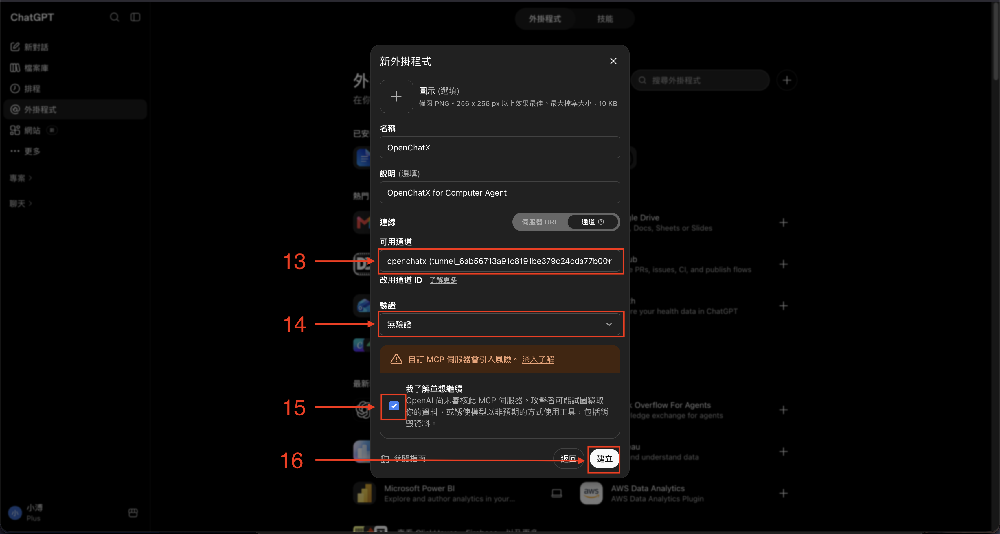
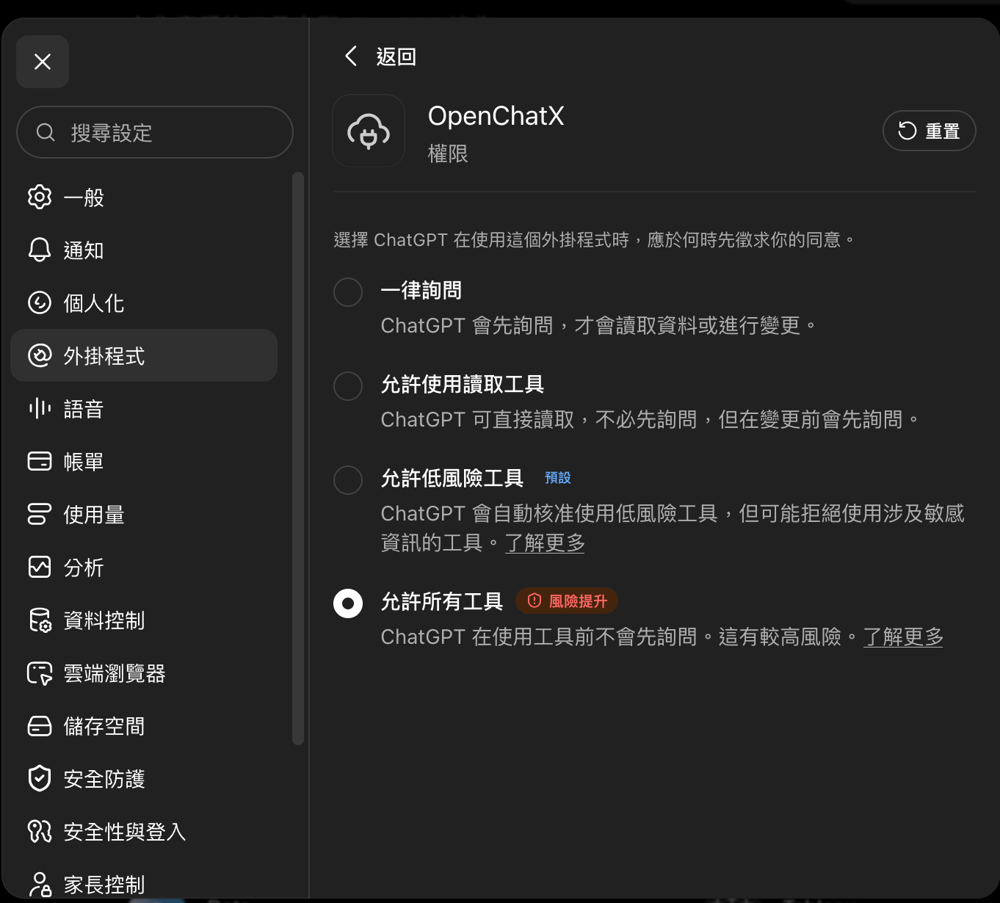

<p align="center">
  
</p>

<h1 align="center">openchatx-mcp</h1>

<p align="center">
  <a href="README.md">English</a> · <strong>繁體中文</strong>
</p>

<p align="center">
  <strong>把 ChatGPT 變成真正的本機 Agent Runtime。</strong><br>
  讓 ChatGPT 直接操作你的電腦、使用本機工具、發現外部 MCP，並調度你自己的模型，只需要一個 MCP 連線。
</p>

<p align="center">
  <a href="LICENSE"></a>
  
</p>

> [!NOTE]
> OpenChatX 跑在一般 ChatGPT 對話裡，不會把 Codex 當成執行後端。換句話說，OpenChatX 本身不會消耗 Codex task 用量；你的 ChatGPT 方案、訊息限制與其他使用政策仍然適用，而且未來可能調整。

> [!CAUTION]
> openchatx-mcp 會以目前作業系統使用者的權限執行。經授權的 ChatGPT 呼叫可以執行指令、修改檔案、抓取網頁，以及控制已連接的工具與應用程式。



## 為什麼是 OpenChatX

ChatGPT 是 Planner，OpenChatX 給它真正能動手做事的能力。

我自己做專案時 AI Agent 用量非常大，甚至曾經半天就把 Pro 20x 的 Codex Weekly Usage 燒到 100%。我不想讓整個工作流綁死在單一 Agent Runtime 的額度上，所以做了 OpenChatX：讓 ChatGPT 可以直接從一般對話操作本機、使用工具、接 MCP、調度自己的模型，而不是一定要把 Codex 當成執行後端。

- **本機執行** — 在 macOS 或原生 Windows 上跑 shell、改檔案、看圖片、使用互動式 Terminal。
- **MCP 聚合** — 把本機 stdio 與遠端 HTTP MCP Server 集中到同一個 ChatGPT MCP 連線。
- **Capability Discovery** — ChatGPT 知道 Blender、Unreal、Browser Automation 等能力存在，但不必一次載入所有 Tool Schema。
- **Toolboxes** — 用資料夾式 Plugin 加入自己的 TypeScript tools 與 reusable skills。
- **Provider-backed Subagents** — 把本地 GPU、自架模型或其他 API 當成可委派 worker，ChatGPT 仍然是主要 Planner。
- **Dashboard** — 從本機 UI 管理 MCP Servers、Toolboxes 與 Subagents。

外部 MCP Tools 與自訂 Toolbox Tools 都採 lazy loading。`start_here` 只提供輕量 Capability Catalog，真正需要某個能力時才透過 `tool_search` 找工具。

## 系統需求

- macOS（Apple Silicon / Intel）或原生 Windows 10/11
- Node.js 22.18.0 或更新版本
- npm
- ripgrep（`rg`）
- [OpenAI tunnel-client](https://github.com/openai/tunnel-client) 並放入 PATH
- ChatGPT 帳號或 Workspace 已開放 Developer Mode / Custom MCP

Windows 直接原生執行，不需要 WSL。OpenChatX 會優先使用 PowerShell 7（`pwsh.exe`），若沒有則回退到 Windows PowerShell（`powershell.exe`）。目前內建的 `apply_patch` binary 仍是 macOS-only；Windows 上一般工作流使用 `file_read` / `file_edit` / `file_write`。

Computer Use 刻意放在外部 MCP，不綁死在 OpenChatX Core 裡。

## 快速開始

### 使用 Coding Agent 安裝

使用內建安裝 Skill：

[`skills/install-openchatx-mcp/SKILL.md`](skills/install-openchatx-mcp/SKILL.md)

### 手動安裝

先把 OpenChatX 專案準備好，但先不要跑完整 `npm run setup`，因為完整 Setup 會檢查 Secure MCP Tunnel 是否已經安裝與設定完成。

macOS：

```bash
brew install ripgrep
git clone https://github.com/XiaoPuOuO/openchatx-mcp.git
cd openchatx-mcp
npm ci
npm run setup -- --config-only
```

Windows PowerShell：

```powershell
winget install BurntSushi.ripgrep.MSVC
git clone https://github.com/XiaoPuOuO/openchatx-mcp.git
Set-Location openchatx-mcp
npm ci
npm run setup -- --config-only
```

第一次安裝請從正常的外部 Terminal 啟動（macOS 使用 Terminal.app；Windows 使用 PowerShell / Windows Terminal），讓 PM2 runtime 繼承正確的系統權限與環境。

### 設定 OpenAI Secure MCP Tunnel

OpenChatX 現在只支援 OpenAI Secure MCP Tunnel，不再使用 ngrok。OpenChatX 的 MCP Server 只監聽本機 `127.0.0.1:3333`，由 `tunnel-client` 主動建立到 OpenAI 的 outbound HTTPS 連線。

#### 1. 安裝 `tunnel-client`

先開啟 [OpenAI Secure MCP Tunnel 官方文件](https://developers.openai.com/zh-Hant/api/docs/guides/secure-mcp-tunnels)，可以從 Platform 的 **Download tunnel-client** 下載，或直接使用 [`openai/tunnel-client` 最新 Release](https://github.com/openai/tunnel-client/releases/latest)。不要在教學裡固定某個版本，直接使用最新相容版本。

macOS 先確認 CPU 架構：

```bash
uname -m
```

- 顯示 `arm64`：下載 `darwin-arm64`。
- 顯示 `x86_64`：下載 `darwin-amd64`。

解壓縮後：

```bash
chmod +x tunnel-client
sudo mv tunnel-client /usr/local/bin/
tunnel-client --help
```

如果 macOS 跳出「Apple 無法驗證 tunnel-client 是否為惡意軟體」，先確認檔案是從 OpenAI 官方 Release 下載，再解除 quarantine：

```bash
sudo xattr -d com.apple.quarantine /usr/local/bin/tunnel-client
```

Windows 則下載符合系統架構的 `tunnel-client.exe`，放到 `PATH` 後確認：

```powershell
tunnel-client --help
```

#### 2. 在 ChatGPT 開始建立 OpenChatX MCP App

先開啟 **Settings → Developer Mode**，接著到 **Plugins** 按 **+**，選擇 **Create app**，再選 **Create MCP app**。









在建立 MCP App 的畫面：

1. 名稱填 `OpenChatX`。
2. 說明可填 `OpenChatX for Computer Agent`。
3. 連線切換成 **通道 / Tunnel**。
4. 按 **建立通道 / Create tunnel**。



#### 3. 在 OpenAI Platform 建立 Tunnel

ChatGPT 會帶你到 Platform 的 [**Tunnels** 設定頁](https://platform.openai.com/settings/organization/tunnels)。建立 Tunnel 時：

1. Name 填 `openchatx`。
2. Description 可填 `openchatx tunnel`。
3. Organizations 選擇自己的 Platform Organization。
4. ChatGPT workspaces 選擇實際要使用 OpenChatX 的 Workspace。
5. 按 **Create**。



建立完成後會得到一個 `tunnel_...` ID。先保留這個 ID，等等 Terminal 初始化 profile 時會用到。這個 Tunnel ID 不是 API Key。

#### 4. 建立 Runtime API Key

到 OpenAI Platform 的 [**API keys** 頁面](https://platform.openai.com/settings/organization/api-keys)新增 Secret Key。建議名稱填 `OpenChatX Runtime Key`，方便日後辨識。有效期限請依自己的安全政策選擇；圖片示範使用 **永不 / Never**，適合需要長期常駐的本機 Runtime。Permissions 最簡單可先使用 **All**；如果組織有既定的 Tunnel 權限政策，也可以改成受限 Key。



Key 建立後只會完整顯示一次，請自行安全保存。

> [!WARNING]
> 不要把 API Key 貼進 ChatGPT、不要 Commit 到 Git，也不要放進 OpenChatX Repository。

把 Key 設到準備執行 OpenChatX 的同一個 Terminal。

macOS：

```bash
export CONTROL_PLANE_API_KEY="<your-runtime-api-key>"
```

Windows PowerShell：

```powershell
$env:CONTROL_PLANE_API_KEY="<your-runtime-api-key>"
```

OpenChatX 不會自動讀取 Repository 裡的 `.env`。重開 Terminal 或重新開機後，如果要重新啟動 OpenChatX，需要再次提供 `CONTROL_PLANE_API_KEY`，或使用你自己的安全 Secret Manager / 環境變數機制。

#### 5. 初始化 OpenChatX Tunnel Profile

把剛才取得的 `tunnel_...` ID 代入：

```bash
tunnel-client init \
  --profile openchatx \
  --tunnel-id <tunnel_id> \
  --mcp-server-url http://127.0.0.1:3333/mcp
```

成功後會建立 `openchatx` profile。如果 `tunnel-client` 顯示 `profile "openchatx" already exists`，而且現有 profile 本來就指向正確的 Tunnel，就不用覆蓋；只有確定要重建 profile 時才使用 `--force`。

OpenChatX 預設設定與它一致：

```toml
[tunnel]
profile = "openchatx"
health_port = 8080
```

接著完成 OpenChatX Setup 並啟動：

```bash
npm run setup
npm start
```

`npm start` 會透過專案自己的 PM2 同時管理：

- `openchatx-mcp`
- `openchatx-tunnel`

所以正常使用時不需要另外開一個 Terminal 手動維持 `tunnel-client run --profile openchatx`。

#### 6. 驗證 Tunnel 與 OpenChatX

執行：

```bash
tunnel-client doctor --profile openchatx --explain
curl -fsS http://127.0.0.1:3333/healthz
curl -fsS http://127.0.0.1:8080/readyz
npm run status
npm run print-url
```

`doctor` 最後應該看到：

```text
RESULT ok
```

Tunnel Client 的本機管理 UI 預設在：

```text
http://127.0.0.1:8080/ui
```

#### 7. 回到 ChatGPT 完成 MCP App

回到剛才的 ChatGPT MCP App 建立視窗：

1. Available Tunnel 選擇剛建立的 `openchatx (tunnel_...)`。
2. 驗證選 **無驗證 / No authentication**。
3. 閱讀並勾選自訂 MCP Server 的風險確認。
4. 按 **建立 / Create**。



如果希望 ChatGPT 不需要每次 Tool Call 都重新詢問，可以把 OpenChatX Plugin 權限設成 **Allow all tools**。



> [!IMPORTANT]
> ChatGPT 要 Discover 或呼叫 OpenChatX Tools 時，`openchatx-tunnel` 必須保持運作。第一個受信任的遠端 Tool Call 會把這個 installation 綁定到該 ChatGPT subject。只有在確定要清除綁定時才執行 `npm run auth:reset`。

### 驗證

```bash
npm run status
curl -fsS http://127.0.0.1:3333/healthz
curl -fsS http://127.0.0.1:8080/readyz
npm run print-url
```

`npm run print-url` 應該會顯示本機 MCP target、目前使用的 Tunnel profile、Tunnel Client UI，以及 OpenChatX UI。

## Capability Discovery

OpenChatX 不會把每一個外部 MCP 或自訂 Tool Schema 全部直接塞進 ChatGPT。

`start_here` 只回傳精簡 Catalog：

```text
External MCP capabilities:
- blender (Blender): available, 32 tools — 3D modeling and scene control
- unreal-engine (Unreal Engine): available, 3 tools — Unreal Editor automation
```

真正需要某個能力時：

```text
tool_search(
  query="create and modify a 3D model",
  source="mcp",
  server="blender"
)
```

ChatGPT 再透過 `tool_call` 呼叫找到的 Tool。這樣一開始就知道「自己有什麼能力」，又不用付出幾百個 Tool Schema 的 context 成本。

## External MCP Servers

想接 Blender、Browser Automation、其他本機 App，或遠端 MCP Server？直接叫 ChatGPT 幫你接就好。

例如：

> 幫我把這個 MCP Server 接進 OpenChatX，然後確認可以正常使用。

ChatGPT 可以自己查看該 MCP 的安裝方式、透過 OpenChatX 完成設定，再幫你驗證連線。你如果想手動管理，也可以直接從 Dashboard 操作。

MCP 暫時連不上不會阻止 OpenChatX 啟動；Capability Catalog 會把它標成 configured but unavailable。

## Provider-backed Subagents

OpenChatX 可以把工作委派給你明確設定的其他模型。Provider 不會自動把整個 Model Catalog 暴露給 ChatGPT，而是由你建立 curated Model Profile。

新安裝預設是空的：

```json
{
  "providers": {},
  "models": {}
}
```

可從 Dashboard 或 gitignored 的 `subagents.json` 設定。

- `subagent_list` — 列出 curated profiles 與用途。
- `subagent_run` — 把一個任務委派給指定 Profile。

## 自訂 Tools

缺一個 OpenChatX 還沒有的能力？直接叫 ChatGPT 幫你寫。

例如：

> 幫我做一個 OpenChatX Tool，可以啟動我的遊戲 Server 並回傳目前狀態。

或：

> 幫我做一個 Tool 連我的本機 API，讓你可以查詢 Projects。

ChatGPT 可以自己建立 Toolbox、撰寫 TypeScript Tool、測試，並讓之後的對話都能使用。你不需要自己手刻 Plugin 結構或 Tool Schema。

自訂 Tools 一樣採 Lazy Discovery，不會因為你加很多工具就把一般 ChatGPT 對話的 Tool Context 撐大。想手動 Enable / Disable 或查看細節時，再到 Dashboard 管理即可。

## File Workflow

```text
read → edit/write → patch only when appropriate
```

- `file_read` — 讀文字檔或 Directory，支援帶行號分頁。
- `file_edit` — 對既有文字檔做 exact replacement，適合局部修改，會回傳 diff。
- `file_write` — 建立或完整覆寫文字檔，會回傳 diff。
- `apply_patch` — 真正適合 Patch 的多檔修改、move/delete、或使用者直接提供 Patch。

## 設定

```text
.openchatx/config.toml   # runtime、state directory、shell、tunnel-client、MCP output
mcp-servers.json        # external MCP servers
subagents.json          # providers 與 curated model profiles
toolboxes/              # built-in 與 custom toolboxes
```

OpenChatX 使用 `[tunnel]` 指定的 `tunnel-client` profile。預設 profile 是 `openchatx`，Tunnel 管理 UI 預設是 `http://127.0.0.1:8080/ui`。

OpenChatX 的持久化狀態都放在 `state_dir`（預設 `~/.openchatx-mcp`）。Setup 會在這裡建立 `~/.openchatx-mcp/AGENTS.md` 與 `~/.openchatx-mcp/skills/`，而且不會覆蓋已經存在的自訂內容。OpenChatX 不再另外建立 Agent Workspace；shell / file / search / image 工具使用相對路徑時，預設從目前使用者的 Home Directory 開始，必要時可以直接傳絕對路徑。

OpenChatX Dashboard 永遠可以從 `/ui` 使用。

## 操作與維護

| 指令 | 用途 |
| --- | --- |
| `npm start` | Build 並啟動 / reload OpenChatX 與 tunnel-client |
| `npm run restart` | Rebuild 並 reload services |
| `npm run restart -- --hard` | 從外部 Terminal 重建專用 PM2 daemon |
| `npm run status` | 查看 service 狀態 |
| `npm run logs` | 查看 logs |
| `npm run print-url` | 顯示本機 MCP target、Tunnel profile/UI 與 OpenChatX UI |
| `npm run stop` | 停止 OpenChatX 與 tunnel-client |
| `npm run auth:reset` | 確認後清除綁定的 ChatGPT subject |

更多 recovery 細節請看 [Configuration and Startup](wiki/pages/operations/configuration-and-startup.md)。

## 安全性

- 只連接你信任的 MCP Servers。
- localhost MCP endpoint 沒有額外 Authentication；不要透過不受信任的 Proxy 暴露。
- Trusted remote calls 會綁定到 `<state_dir>/auth.json` 裡的第一個 ChatGPT subject。
- `agent-commands.yaml` 可能包含敏感 Tool Input，因此預設 gitignored。

完整安全模型與回報方式請看 [SECURITY.md](SECURITY.md)。

## 開發

```bash
npm run lint
npm run typecheck
npm test
npm run build
npm run ui:lint
npm run ui:build
```

- `npm run inspect` — 開啟 MCP Inspector。
- `npm run schemas` — 印出目前 Published MCP Tool Schemas。

更多實作細節放在 [Maintainer Wiki](wiki/)。

## License

[MIT](LICENSE)。

Vendored `apply_patch` binary 保留 upstream OpenAI Codex license 與 notices，位於 [`vendor/apply-patch/`](vendor/apply-patch/)。

## Attribution

本專案部分程式碼衍生自 [Shellby MCP](https://github.com/Serbyte-Development/shellby-mcp)，原作者為 Serbyte Development，採 MIT License。原始授權聲明保留於 [`THIRD_PARTY_NOTICES.md`](THIRD_PARTY_NOTICES.md)。
