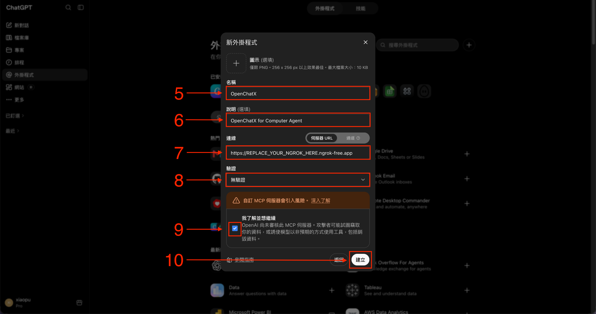

<p align="center">
  
</p>

<h1 align="center">openchatx-mcp</h1>

<p align="center">
  <a href="README.md">English</a> · <strong>繁體中文</strong>
</p>

<p align="center">
  <strong>把 ChatGPT 變成真正的本機 Agent Runtime。</strong><br>
  讓 ChatGPT 直接操作你的 Mac、使用本機工具、發現外部 MCP，並調度你自己的模型，只需要一個 MCP 連線。
</p>

<p align="center">
  <a href="LICENSE"></a>
  
</p>

> [!NOTE]
> OpenChatX 跑在一般 ChatGPT 對話裡，不會把 Codex 當成執行後端。換句話說，OpenChatX 本身不會消耗 Codex task 用量；你的 ChatGPT 方案、訊息限制與其他使用政策仍然適用，而且未來可能調整。

> [!CAUTION]
> openchatx-mcp 會以目前 macOS 使用者的權限執行。經授權的 ChatGPT 呼叫可以執行指令、修改檔案、抓取網頁，以及控制已連接的工具與應用程式。


## 為什麼是 OpenChatX

ChatGPT 是 Planner，OpenChatX 給它真正能動手做事的能力。

- **本機執行** — 在 Mac 上跑 shell、改檔案、看圖片、使用互動式 Terminal。
- **MCP 聚合** — 把本機 stdio 與遠端 HTTP MCP Server 集中到同一個 ChatGPT MCP 連線。
- **Capability Discovery** — ChatGPT 知道 Blender、Unreal、Browser Automation 等能力存在，但不必一次載入所有 Tool Schema。
- **Toolboxes** — 用資料夾式 Plugin 加入自己的 TypeScript tools 與 reusable skills。
- **Provider-backed Subagents** — 把本地 GPU、自架模型或其他 API 當成可委派 worker，ChatGPT 仍然是主要 Planner。
- **Dashboard** — 從本機 UI 管理 MCP Servers、Toolboxes 與 Subagents。

外部 MCP Tools 與自訂 Toolbox Tools 都採 lazy loading。`start_here` 只提供輕量 Capability Catalog，真正需要某個能力時才透過 `tool_search` 找工具。

## 系統需求

- macOS，支援 Apple Silicon 與 Intel
- Node.js 22.18.0 或更新版本
- npm
- [ngrok](https://ngrok.com/) 帳號與 CLI
- ChatGPT 帳號或 Workspace 已開放 Developer Mode / Custom MCP

Computer Use 刻意放在外部 MCP，不綁死在 OpenChatX Core 裡。

## 快速開始

### 使用 Coding Agent 安裝

使用內建安裝 Skill：

[`skills/install-openchatx-mcp/SKILL.md`](skills/install-openchatx-mcp/SKILL.md)

### 手動安裝

```bash
brew install --cask ngrok
git clone https://github.com/XiaoPuOuO/openchatx-mcp.git
cd openchatx-mcp
npm ci

ngrok config add-authtoken <your-token>

npm run setup -- --config-only
npm run setup
npm start
```

第一次安裝建議從 Terminal.app 執行，讓 macOS 權限處於正常互動式環境。

### 加到 ChatGPT

1. 開啟 **Settings** 並啟用 **Developer Mode**。

   

   

2. 從 **Plugins** 按 **+**，選擇 **Create app**。

   

3. 選擇 **Create MCP app**。

   

4. 填入：
   - Name：`OpenChatX`
   - Server URL：`npm run print-url` 輸出的 `https://.../mcp`
   - Authentication：**No Auth**

   

5. 如果希望 ChatGPT 不需要每次 Tool Call 都再次確認，可以把 OpenChatX Plugin 權限設成 **Allow all tools**。

   

> [!IMPORTANT]
> 第一個受信任的遠端 Tool Call 會把這個 installation 綁定到該 ChatGPT subject。只有在確定要清除綁定時才執行 `npm run auth:reset`。

### 驗證

```bash
npm run status
curl -fsS http://127.0.0.1:3333/healthz
npm run print-url
```

```text
MCP: http://127.0.0.1:3333/mcp
UI:  http://127.0.0.1:3333/ui
```

## Capability Discovery

OpenChatX 不會把每一個外部 MCP 或自訂 Tool Schema 全部直接塞進 ChatGPT。

`start_here` 只回傳精簡 Catalog：

```text
External MCP capabilities:
- blender (Blender): available, 32 tools — 3D modeling and scene control
- unreal-engine (Unreal Engine): available, 3 tools — Unreal Editor automation
```

真正需要某個能力時：

```text
tool_search(
  query="create and modify a 3D model",
  source="mcp",
  server="blender"
)
```

ChatGPT 再透過 `tool_call` 呼叫找到的 Tool。這樣一開始就知道「自己有什麼能力」，又不用付出幾百個 Tool Schema 的 context 成本。

## External MCP Servers

新安裝預設沒有任何外部 MCP Server。可以從 Dashboard 新增，或建立 gitignored 的 `mcp-servers.json`。

```json
{
  "open-computer-use": {
    "type": "local",
    "command": ["/opt/homebrew/bin/open-computer-use", "mcp"],
    "enabled": true,
    "description": "macOS GUI control"
  }
}
```

MCP 暫時連不上不會阻止 OpenChatX 啟動；Capability Catalog 會把它標成 configured but unavailable。

## Provider-backed Subagents

OpenChatX 可以把工作委派給你明確設定的其他模型。Provider 不會自動把整個 Model Catalog 暴露給 ChatGPT，而是由你建立 curated Model Profile。

新安裝預設是空的：

```json
{
  "providers": {},
  "models": {}
}
```

可從 Dashboard 或 gitignored 的 `subagents.json` 設定。

- `subagent_list` — 列出 curated profiles 與用途。
- `subagent_run` — 把一個任務委派給指定 Profile。

## Toolboxes

Toolbox 是放在 `toolboxes/` 下的資料夾式 Plugin：

```text
toolboxes/
└── my-tools/
    ├── toolbox.json
    ├── tools/
    │   └── hello.ts
    └── skills/
        └── debug-app/
            └── SKILL.md
```

Dashboard 可以 Enable / Disable Toolbox、單一 Tool、Skill，也能建立 starter template。自訂 Tools 同樣透過 `tool_search` lazy discovery，再用 `tool_call` 執行。

## File Workflow

```text
read → edit/write → patch only when appropriate
```

- `file_read` — 讀文字檔或 Directory，支援帶行號分頁。
- `file_edit` — 對既有文字檔做 exact replacement，適合局部修改，會回傳 diff。
- `file_write` — 建立或完整覆寫文字檔，會回傳 diff。
- `apply_patch` — 真正適合 Patch 的多檔修改、move/delete、或使用者直接提供 Patch。

## 設定

```text
.openchatx/config.toml   # runtime、workspace、shell、ngrok、MCP output
mcp-servers.json        # external MCP servers
subagents.json          # providers 與 curated model profiles
toolboxes/              # built-in 與 custom toolboxes
```

如果希望 PM2 / ngrok 重啟後 ChatGPT Connector URL 不變：

```toml
[ngrok]
url = "https://your-static-domain.ngrok-free.dev"
```

Dashboard 永遠可以從 `/ui` 使用。

## 操作與維護

| 指令 | 用途 |
| --- | --- |
| `npm start` | Build 並啟動 / reload OpenChatX 與 ngrok |
| `npm run restart` | Rebuild 並 reload services |
| `npm run restart -- --hard` | 從 Terminal.app 重建專用 PM2 daemon |
| `npm run status` | 查看 service 狀態 |
| `npm run logs` | 查看 logs |
| `npm run print-url` | 顯示公開 MCP URL 與本機 UI URL |
| `npm run stop` | 停止 OpenChatX 與 ngrok |
| `npm run auth:reset` | 確認後清除綁定的 ChatGPT subject |

更多 recovery 細節請看 [Configuration and Startup](wiki/pages/operations/configuration-and-startup.md)。

## 安全性

- 只連接你信任的 MCP Servers。
- localhost MCP endpoint 沒有額外 Authentication；不要透過不受信任的 Proxy 暴露。
- Trusted remote calls 會綁定到 `<state_dir>/auth.json` 裡的第一個 ChatGPT subject。
- `agent-commands.yaml` 可能包含敏感 Tool Input，因此預設 gitignored。

完整安全模型與回報方式請看 [SECURITY.md](SECURITY.md)。

## 開發

```bash
npm run lint
npm run typecheck
npm test
npm run build
npm run ui:lint
npm run ui:build
```

- `npm run inspect` — 開啟 MCP Inspector。
- `npm run schemas` — 印出目前 Published MCP Tool Schemas。

更多實作細節放在 [Maintainer Wiki](wiki/)。

## License

[MIT](LICENSE)。

Vendored `apply_patch` binary 保留 upstream OpenAI Codex license 與 notices，位於 [`vendor/apply-patch/`](vendor/apply-patch/)。

## Attribution

本專案部分程式碼衍生自 [Shellby MCP](https://github.com/Serbyte-Development/shellby-mcp)，原作者為 Serbyte Development，採 MIT License。原始授權聲明保留於 [`THIRD_PARTY_NOTICES.md`](THIRD_PARTY_NOTICES.md)。
